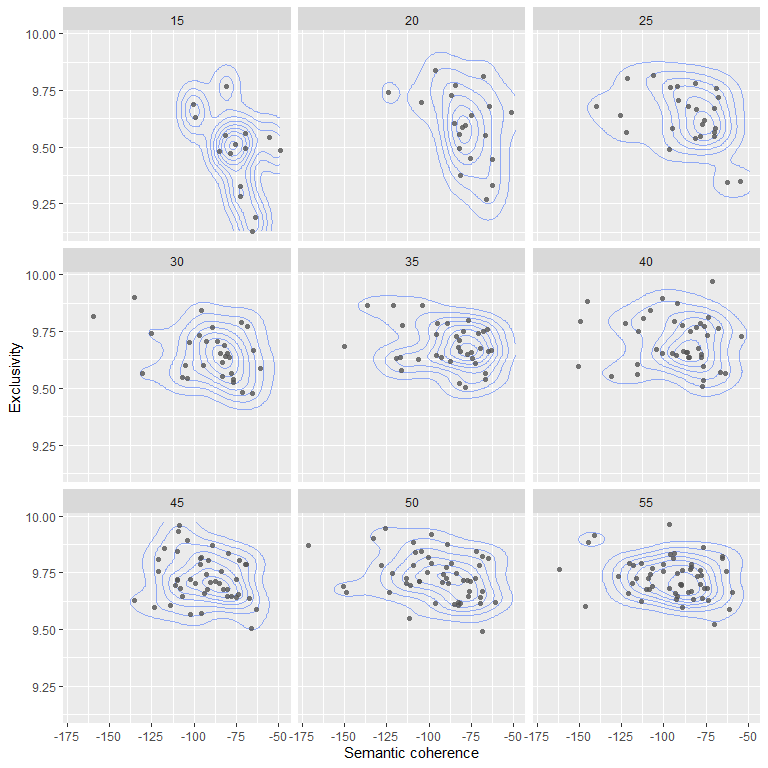

```{r, include = FALSE}
knitr::opts_chunk$set(
  echo = FALSE,
  message = FALSE,
  warning = FALSE,
  collapse = TRUE,
  cache = FALSE,
  comment = ">#"
)
```


```{r setup}
library(srcquantcourse)
library(dplyr)
library(tidyr)
library(stringr)
library(stm)
library(stminsights)
library(ggplot2)
```


# 'K' --- the number of topics

Topic modeling algorithms like `stm()` are unsupervised classification methods, but they require one input parameter, *K*, which is the number of topics that should be fit to a given document collection. Choosing a suitable number of topics is one of the key challenges when fitting a topic model.

There is in fact no correct or best number of topics for a given document corpus. Ultimately, the chosen number of topics defines the level of granularity at which we can explore the topical structure of a document collection. One factor in the choice of *K* will thus be practical considerations and the questions a topic model should help to answer.

There exist however a number of metrics to assess how well a given number of topics can explain a document collection [@RobertsStewart_et_2019_JSTATS_91; @WallachMurray_et_2009_ICML_Conf]. The `stm()` package supports several of these approaches. For the sample analysis included in the `vignette("covid-preprint-topics")` we considered these measures to determine a suitable *K*, one that is ideally producing both a good model fit and deliver a navigable number of topics for an exploratory analysis.

The `stm` package offers two approaches to determine a suitable *K*, either by letting `stm` decide the number of topics or by fitting multiple models with different topic numbers in parallel and comparing the various measures for goodness of model fit. Both approaches are discussed below.

Note that the pre-processing options available when preparing the document corpus for topic modeling will impact the runtime duration of the algorithm and may also impact the model fit (see `vignette("covid-preprint-topics")` for an explanation of different steps).


# Finding the best *'K'*

## Let `stm` determine a suitable topic number

The main `stm` function offers an option to set *K* to `0` which triggers a processing workflow that determines a suitable number of topics. This option uses an approach described by [@MimnoLee_2014_EMNLP_Conf] (it is however not deterministic).

```{r, eval=FALSE, echo=TRUE}
model_K0 <- stm(mydocs_dfm, K = 0)

```

Since this approach is not deterministic, different executions with this setting may result in different topic numbers and different word to topic assignments.


## Comparing topic models with different *K*s

The `stm` package provides the `searchK()`function, which allows to run multiple model fits with different `K`s and then returns the different measures for model fit. Here we use instead an alternative approach employing the `future` and `furrr` packages^[See also this [blog post](https://juliasilge.com/blog/evaluating-stm/) for a great overview.].

A more detailed (and resource-intensive approach) is to fit models with multiple options of *K*, and evaluate the best or most suitable choice based on different measures for goodness of fit. In the following, we will use four metrics --- *held-out likelihood* [@WallachMurray_et_2009_ICML_Conf], *residual dispersion* [@Taddy_2012_AIS_Conf], *semantic coherence* [@MimnoWallach_et_2011_EMNLP_Conf] and *exclusivity* [@RobertsStewart_et_2019_JSTATS_91] --- to assess the quality of topic models with different *K*s^[See also [this blog by Julia Silge](https://juliasilge.com/blog/evaluating-stm/) for a good overview of evaluating topic models with `stm`.]. 

One of those, *held-out likelihood*, requires an evaluation of a topic model against an unseen data set. We follow the default approach suggested by  [@RobertsStewart_et_2019_JSTATS_91] and use `stm`'s `make.heldout` method to split the  document corpus (transformed in a document-feature matrix) in a training and a testing set --- models are fit for the training set and held-out likelihood is then evaluated against the testing set.

```{r, eval=FALSE, echo=TRUE}
library(stm)

# a seed is needed for replicability 
heldout_corpus <- make.heldout(mydocs_dfm, seed = 6406852)
```

In preparation of evaluating the models we use `stm`'s `make.heldout` function, which  splits a given document corpus into two parts, a core document set for fitting the model(s) and a "missing" set that can be used to measure --- with the function `eval.heldout` --- how well the model performs on an unseen document set. 

Fo illustration two subsets of [bioRxiv](https://www.biorxiv.org/) and [medRxiv](https://www.medrxiv.org/) preprints potentially covering the topic *"biodiversity"* and *"sustainability/social-ecological systems"* respectively were created. For both subsets, the results of fitting models with *K*'s ranging from 5 to 100 (in intervals of 5) were evaluated. Depending on the system configuration, fitting those models can take several hours.

For the code section below we assume that we have previously created a document-feature matrix (`pubs_dfm`) from a document set.

```{r, eval=FALSE, echo=TRUE}
library(quanteda)
library(stm)
library(furrr)
library(purrr)

# create a set of Ks to evaluate
K_values <- tibble::tibble(K = seq.int(from = 5, to = 100, by = 5))

# create a heldout corpus for evaluation of model fit
# (a seed can be provided for replicability)
pubs_dfm_heldout <- make.heldout(pubs_dfm, seed = 1234567)

# create document format required by stm
stm_docs <- quanteda::convert(pubs_dfm_heldout, to = "stm")

# consult the futures package for details on parallelization options
plan("multisession")

# fit the STM models with different Ks
# supplying a seed allows replication, but can also be retrieved from the model
models_K5_100 <- K_values %>%
  mutate(topic_model = future_map(K, ~stm(documents = stm_docs$documents,
                                          vocab = stm_docs$vocab,
                                          data = stm_docs$meta,
                                          prevalence = ~ server * s(year),
                                          K = .,
                                          verbose = FALSE,
                                          seed = 8912388),
                                  .options = furrr_options(seed = 8912388)))

# extract model fit metrics
metrics_K5_100 <- models_K5_100 %>%
  mutate(exclusivity = future_map(topic_model, exclusivity),
         semantic_coherence = future_map(topic_model, semanticCoherence,
                                         pubs_dfm_heldout$documents),
         eval_heldout = future_map(topic_model, eval.heldout,
                                   pubs_dfm_heldout$missing),
         residual = future_map(topic_model, checkResiduals,
                               pubs_dfm_heldout$documents))

plan("sequential")
```

Now we can explore the results for the four metrics mentioned earlier.

```{r, eval=FALSE, echo=FALSE, fig.height=4, fig.width=7, dpi=300}
library(ggplot2)
library(tidyr)
library(purrr)

topicmodel_evaluations <- pubs_metrics %>%
  group_by(subset_label) %>%
  transmute(K,
            iterations = map_dbl(map(topic_model, "convergence"), "its"),
            converged = map_lgl(map(topic_model, "convergence"), "converged"),
            heldout_likelihood = map_dbl(eval_heldout, "expected.heldout"),
            semantic_coherence = map_dbl(semantic_coherence, median),
            residuals = map_dbl(residual, "dispersion"),
            exclusivity = map_dbl(exclusivity, median)) %>%
  ungroup() %>%
  tidyr::gather(model_metric, value, -K, -subset_label) %>%
  mutate(model_metric = factor(model_metric,
                               levels = c("converged", "iterations",
                                          "heldout_likelihood", "semantic_coherence",
                                          "residuals", "exclusivity"),
                               labels = c("Converged", "Iterations",
                                          "Held-out likelihood", "Semantic coherence",
                                          "Residuals", "Exclusivity")))

#metrics_models_K5_125 %>%
metrics_models_K25_150 %>%
  transmute(K,
            heldout_likelihood = map_dbl(eval_heldout, "expected.heldout"),
            semantic_coherence = map_dbl(semantic_coherence, mean),
            residuals = map_dbl(residual, "dispersion"),
            exclusivity = map_dbl(exclusivity, mean)) %>%
  gather(model_metric, value, -K) %>%
  mutate(model_metric = factor(model_metric, 
                               levels = c("heldout_likelihood", "semantic_coherence",
                                          "residuals", "exclusivity"),
                               labels = c("Held-out likelihood", "Semantic coherence",
                                          "Residuals", "Exclusivity"))) %>%
  ggplot(aes(K, value, color = model_metric)) +
  #scale_x_continuous(breaks = seq.int(0, 120, 20)) +
  scale_x_continuous(breaks = seq.int(0, 150, 20)) +
  geom_line(show.legend = FALSE) +
  geom_point(show.legend = FALSE) +
  facet_wrap(~model_metric, scales = "free_y", ncol = 2) +
  labs(x = "Number of topics (K)", y = NULL) +
  theme_stwd_base() +
  theme(panel.grid.major.x = ggplot2::element_line(colour = "#969696"),
        panel.grid.major.y = ggplot2::element_blank())
```

```{r, fig.height=5, fig.width=7, dpi=1500}
topicmodel_evaluations %>%
  filter(subset_label %in% c("SES preprints", 
                             #"ML/AI preprints",
                             "Biodiversity preprints")) %>%
  filter(!(model_metric %in% c("Converged", "Iterations"))) %>%
  #filter(K <= 70) %>%
  ggplot(aes(K, value, color = model_metric, group = subset_label)) +
  scale_x_continuous(breaks = seq.int(0, 100, 10), limits = c(0, NA)) +
  #geom_smooth(colour = "black") +
  geom_line(show.legend = TRUE, aes(colour = subset_label)) +
  geom_point(show.legend = TRUE, aes(colour = subset_label)) +
  facet_wrap(~model_metric, scales = "free_y", ncol = 2) +
  labs(x = "Number of topics (K)", y = NULL) +
  theme_minimal() +
  theme(panel.grid.major.x = ggplot2::element_line(colour = "#969696"),
        panel.grid.major.y = ggplot2::element_blank(),
        legend.position = "bottom")
```

The **document completion held-out likelihood** [@WallachMurray_et_2009_ICML_Conf] and **residual dispersion** [@Taddy_2012_AIS_Conf] help us to assess how well a topic model explains a given document corpus. **Exclusivity** [@RobertsStewart_et_2019_JSTATS_91]and **semantic coherence** [@MimnoWallach_et_2011_EMNLP_Conf] can help to assess the quality of the topic assignments and their interpretability.

In order to compute **held-out likelihood** we created a held-out dataset. The held-out likelihood measures how well a topic model performs on previously unseen documents. There is no specific number that identifies the best *K* and thus the best topic model, but held-out likelihood allows comparisons between different models, with smaller numbers indicating a better fit. For the evaluated *biodiversity preprints* subset held-out likelihood peaks at 15 topics and declines quickly for higher *Ks*, for the *SES preprints* it peaks at 40 topics but does not show the same large differences for the evaluated *Ks*.

The **residual dispersion** can be used as a measure for the unexplained variance in a topic model [@Taddy_2012_AIS_Conf]. This measure can again be used to compare different model options. Our evaluation indicates that larger *K*'s seem to reduce residual overdispersion, but the improvements level off from around 30 topics for both evaluated subsets and increases again for higher *Ks*.

**Semantic coherence** measures how frequently the most probable words in a topic co-occur in the modeled documents. The coherence metric appears to align well with expert evaluations of topic quality [@MimnoWallach_et_2011_EMNLP_Conf]. [@RobertsStewart_et_2019_JSTATS_91] suggest however that semantic coherence can be easily achieved by having a small number of topics dominated by common words. This is in line with the evaluations for both document subsets showing that the average semantic coherence of topics decreases with larger *Ks*, slower however from around 65 topics, with an intermediate peak at 40 topics.

[@RobertsStewart_et_2019_JSTATS_91] suggest an additional measure: **exclusivity**. A topic's exclusivity score considers both the exclusivity and frequency of words in a topic [@RobertsStewart_et_2019_JSTATS_91; @BischofAiroldi_2012_ICML_Conf]. Simply put, topic models with higher exclusivity scores indicate a better delineation of topics. 
Large *Ks* lead to a higher mean exclusivity of topics, but in our example the gains appear to be smaller from around 20 topic. Deciding on a number of topics based on these latter metrics is thus a trade-off between maximizing semantic coherence or exclusivity.

The combined assessment of all four metrics does not suggest a clear winner. For the *SES preprints* subset we could make a case for topic numbers in the range of 20 to 50 topics. A common approach to arrive at a suitable choice for *K* is to evaluate topic numbers iteratively, i.e. in the example above it would be potentially helpful to next evaluate all *Ks* in the range 20 to 50.   

It can therefore be helpful to look at the values for exclusivity and semantic coherence for **individual topics** in a set of models, an approach also suggested by [@RobertsStewart_et_2019_JSTATS_91]. 

```{r, eval=FALSE, fig.height=8, fig.width=8, dpi=150}
library(ggplot2)

metrics_K5_100 %>%
  select(K, exclusivity, semantic_coherence) %>%
  filter(K >= 15 & K <= 55) %>%
  unnest() %>%
  ggplot(aes(semantic_coherence, exclusivity)) +
    geom_density_2d(alpha = 0.5, show.legend = FALSE) + 
    geom_point(color = "#525252", shape = 16, 
               alpha = 0.8, show.legend = FALSE) +
    labs(x = "Semantic coherence", y = "Exclusivity") +
    facet_wrap(~K, ncol = 3) 
```

```{r echo=FALSE}

```


This more detailed look illustrates again that exclusivity improves "at the expense of" semantic coherence. Again, we cannot identify a "clear winner", but Ks in the range 30 to 45 might be a reasonable choices for a sample analysis --- there are no large gains in topic exclusivity beyond 30 topics, but more topics show distinctly lower semantic coherence beyond 45 topics. Ultimately, this approach can help to identify a suitable range of *Ks*, but the choice should also be informed by the explored research questions, practical considerations and ideally domain knowledge about the anaylsed documents.  

# References

<div id="refs"></div>


# Appendix {-}

The following sections show additional evaluations for (subsets of) the *bioRxiv/medRxiv* preprints. 

## Additional sample evaluations

### All preprints

```{r, fig.height=7, fig.width=10, dpi=150}
topicmodel_evaluations %>%
  filter(subset_label %in% c("All preprints")) %>%
  filter(!(model_metric %in% c("Converged", "Iterations"))) %>%
  #filter(K <= 70) %>%
  ggplot(aes(K, value, color = model_metric, group = subset_label)) +
  scale_x_continuous(breaks = seq.int(0, 100, 10), limits = c(0, NA)) +
  #geom_smooth(colour = "black") +
  geom_line(show.legend = TRUE, aes(colour = subset_label)) +
  geom_point(show.legend = TRUE, aes(colour = subset_label)) +
  facet_wrap(~model_metric, scales = "free_y", ncol = 2) +
  labs(x = "Number of topics (K)", y = NULL) +
  theme_minimal() +
  theme(panel.grid.major.x = ggplot2::element_line(colour = "#969696"),
        panel.grid.major.y = ggplot2::element_blank(),
        legend.position = "bottom")
```


### Covid preprints

```{r, fig.height=7, fig.width=10, dpi=150}

srcquantcourse::topicmodel_evaluations %>%
  filter(subset_label %in% c("Covid preprints")) %>%
  filter(!(model_metric %in% c("Converged", "Iterations"))) %>%
  #filter(K <= 70) %>%
  ggplot(aes(K, value, color = model_metric, group = subset_label)) +
  scale_x_continuous(breaks = seq.int(0, 100, 10), limits = c(0, NA)) +
  #geom_smooth(colour = "black") +
  geom_line(show.legend = TRUE, aes(colour = subset_label)) +
  geom_point(show.legend = TRUE, aes(colour = subset_label)) +
  facet_wrap(~model_metric, scales = "free_y", ncol = 2) +
  labs(x = "Number of topics (K)", y = NULL) +
  theme_minimal() +
  theme(panel.grid.major.x = ggplot2::element_line(colour = "#969696"),
        panel.grid.major.y = ggplot2::element_blank(),
        legend.position = "bottom")
```

### Preprints referencing AI and machine learning

```{r, fig.height=7, fig.width=10, dpi=150}
topicmodel_evaluations %>%
  filter(subset_label %in% c("ML/AI preprints")) %>%
  filter(!(model_metric %in% c("Converged", "Iterations"))) %>%
  #filter(K <= 70) %>%
  ggplot(aes(K, value, color = model_metric, group = subset_label)) +
  scale_x_continuous(breaks = seq.int(0, 100, 10), limits = c(0, NA)) +
  #geom_smooth(colour = "black") +
  geom_line(show.legend = TRUE, aes(colour = subset_label)) +
  geom_point(show.legend = TRUE, aes(colour = subset_label)) +
  facet_wrap(~model_metric, scales = "free_y", ncol = 2) +
  labs(x = "Number of topics (K)", y = NULL) +
  theme_minimal() +
  theme(panel.grid.major.x = ggplot2::element_line(colour = "#969696"),
        panel.grid.major.y = ggplot2::element_blank(),
        legend.position = "bottom")
```
